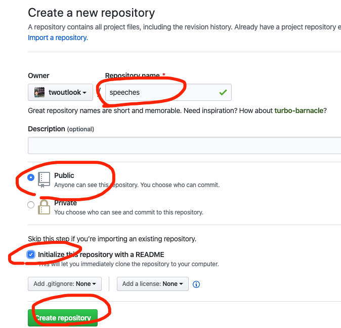

# WEST Toastmaster Club Member

- Mark https://github.com/twoutlook/speeches/
- Echo https://github.com/e1111-cute/speech
-
| Name      |    Repository                          |
|:----------|:--------------------------------------:|
| Mark      |  https://github.com/twoutlook/speeches/|
| Echo      |  https://github.com/e1111-cute/speech  |

## (1) Create a Github Account
 https://github.com to Sign Up

## (2) New Repository: speeches

## (3) Assist another member to complete (1) and (2)

## (4) Share your speeches and Check others' speeches

## (5) Learn some basic operations on Github
- You can create your private repository
- You can Fork other's repository and contribute your input
- You can get other's public repository content completely

